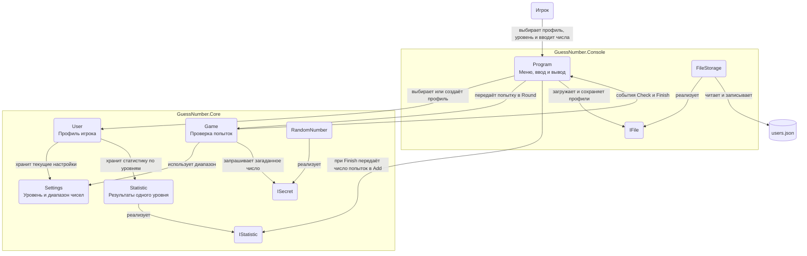

### Структура проекта

```mermaid
flowchart TD
    Player("Игрок")
    subgraph ConsoleApp["GuessNumber.Console"]
        Program("Program<br/>Меню, ввод и вывод")
        IFile("IFile")
        FileStorage("FileStorage")
    end
    subgraph Core["GuessNumber.Core"]
        User("User<br/>Профиль игрока")
        Settings("Settings<br/>Уровень и диапазон чисел")
        Game("Game<br/>Проверка попыток")
        ISecret("ISecret")
        RandomNumber("RandomNumber")
        IStatistic("IStatistic")
        Statistic("Statistic<br/>Результаты одного уровня")
    end
    UsersFile[("users.json")]

    Player -->|выбирает профиль, уровень и вводит числа| Program
    Program -->|выбирает или создаёт профиль| User
    User -->|хранит текущие настройки| Settings
    User -->|хранит статистику по уровням| Statistic

    Program -->|передаёт попытку в Round| Game
    Game -->|использует диапазон| Settings
    Game -->|запрашивает загаданное число| ISecret
    RandomNumber -->|реализует| ISecret
    Game -->|события Check и Finish| Program
    Program -->|при Finish передаёт число попыток в Add| IStatistic
    Statistic -->|реализует| IStatistic

    Program -->|загружает и сохраняет профили| IFile
    FileStorage -->|реализует| IFile
    FileStorage -->|читает и записывает| UsersFile
```
