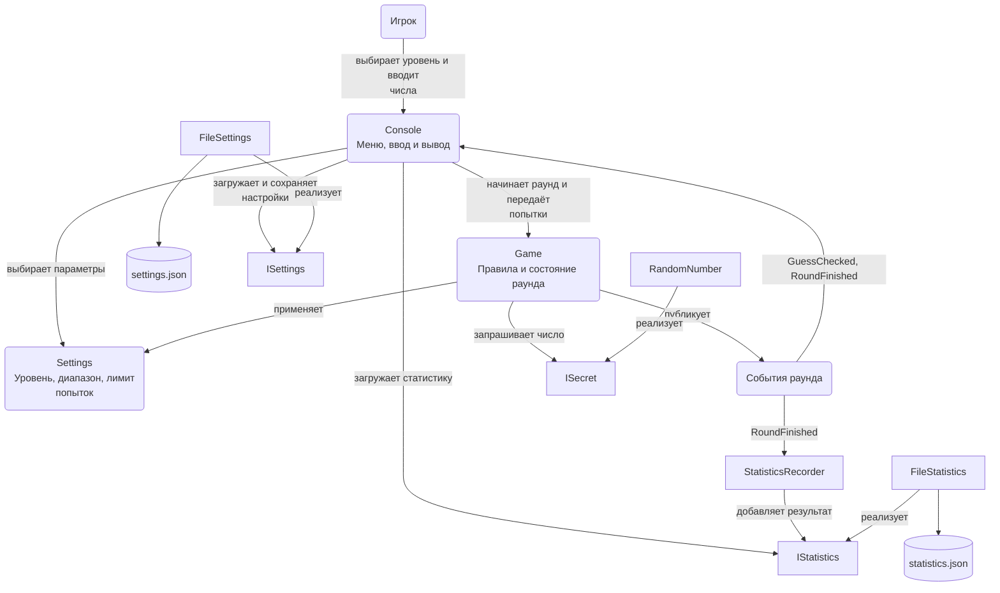

### Структура проекта

```mermaid
flowchart TD
    Player("Игрок")
    Console("Console<br/>Меню, ввод и вывод")
    Game("Game<br/>Правила и состояние раунда")
    Settings("Settings<br/>Уровень, диапазон, лимит<br/>попыток")
    RoundEvents("События раунда")
    SettingsFile[("settings.json")]
    StatisticsFile[("statistics.json")]

    Player -->|выбирает уровень и вводит<br/>числа| Console
    Console -->|выбирает параметры| Settings
    Console -->|начинает раунд и передаёт<br/>попытки| Game
    Console -->|загружает и сохраняет<br/>настройки| ISettings
    Console -->|загружает статистику| IStatistics
    Game -->|применяет| Settings
    Game -->|запрашивает число| ISecret
    Game -->|публикует| RoundEvents
    RandomNumber -->|реализует| ISecret
    RoundEvents -->|GuessChecked, RoundFinished| Console
    RoundEvents -->|RoundFinished| StatisticsRecorder
    StatisticsRecorder -->|добавляет результат| IStatistics
    FileSettings -->|реализует| ISettings
    FileSettings --> SettingsFile
    FileStatistics -->|реализует| IStatistics
    FileStatistics --> StatisticsFile
```